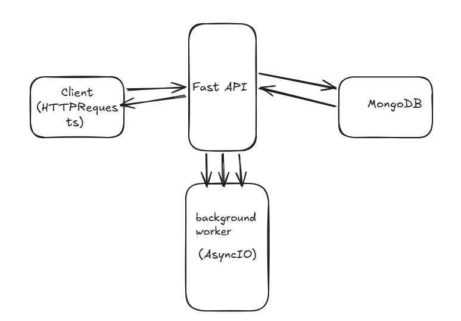

# Metadata Inventory

A simple FastAPI service that collects and stores HTTP metadata (headers, cookies, and page source) for any given URL. MongoDB is used as a cache so the same URL doesn’t need to be fetched again and again.

---

## Project Structure

Here’s a quick overview of how the project is organized:

- `app/config.py`  
  Handles configuration using environment variables.

- `app/database.py`  
  Manages MongoDB connection and provides collection access.

- `app/models.py`  
  Contains Pydantic models for request/response validation.

- `app/services.py`  
  Core logic for fetching metadata and interacting with the database.

- `app/worker.py`  
  Handles background tasks using asyncio (no external queue needed).

- `app/routes.py`  
  Defines the API endpoints.

- `app/main.py`  
  Entry point of the FastAPI application.

---

# Architecture Diagram



## Prerequisites

Make sure you have the following installed:

- Docker  
- Docker Compose  

---

## Running the Service

Start everything using Docker:

```bash
docker-compose up --build

The API will be available at **http://localhost:8000**.

### API Documentation

FastAPI auto-generates interactive docs:

- **Swagger UI**: http://localhost:8000/docs
- **ReDoc**: http://localhost:8000/redoc

## API Endpoints

### `POST /metadata/`

Collect metadata for a given URL immediately.

**Request:**
```json
{
  "url": "https://example.com"
}
```

**Response (201 Created):**
```json
{
  "url": "https://example.com",
  "headers": { "content-type": "text/html; charset=UTF-8", "..." : "..." },
  "cookies": {},
  "page_source": "<!doctype html>...",
  "collected_at": "2024-01-15T10:30:00"
}
```

**Error (502 Bad Gateway):** Returned if the target URL cannot be fetched.

### `GET /metadata/?url=<URL>`

Retrieve cached metadata for a URL.

**Cache hit 200 OK:** Returns the full metadata record.

**Cache miss 202 Accepted:**
JSON format 
{
  "message": "Request accepted. Metadata collection has been queued.",
  "url": "https://example.com",
  "status": "pending"
}


The metadata will be collected asynchronously in the background. Subsequent GET requests will return the data once collection is complete.

### `GET /health`

Health check endpoint. Returns `{"status": "healthy"}`.


### Mongo Db testing Configuration ###
MONGODB_URI	     mongodb://localhost:27017	Connection string for MongoDB
MONGODB_DB_NAME	 metadata_inventory	Name of the database being used


### Use this bash command locally into your system if dont have docker run in windoes wsl run these tests locally 
docker-compose run --rm api python -m pytest -v
```


## Installing Dependencies

To run this locally, install the required packages and execute the tests:

```bash
pip install -r requirements.txt
python -m pytest -v

A few choices made while building this:

Background tasks are handled using asyncio.create_task, so there’s no need to bring in something like Redis or Celery. Also added a simple check to avoid running duplicate tasks for the same URL.
For storing data, MongoDB’s update_one with upsert=True is used. This keeps things simple by handling both insert and update in one go and avoids duplicate records.
There’s a unique index on the url field to make lookups faster and ensure data consistency.
The code is split in a way that keeps responsibilities clear — routes handle API stuff, services contain the core logic, and the worker manages background execution. Makes it easier to test and maintain.
The Docker container runs as a non-root user (appuser) just to follow basic security practices.
Added a health check for MongoDB so that the API only starts once the database is actually ready.